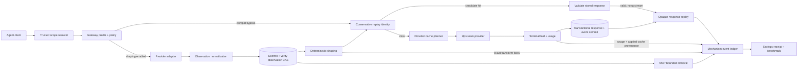

# Maximize Rewind Token Savings - Plan

## Goal Capsule

Turn Rewind from a sound but partially dormant record/replay gateway into a provider-complete, durable, measurable context-efficiency layer. It must eliminate repeated model work, preserve provider prompt-cache discounts, remove redundant context before it reaches a model, and keep its own MCP/control-plane token tax bounded. Exact replay correctness, full-fidelity retrieval, tenant isolation, and conservative accounting remain hard constraints.

**Appetite:** 10–14 weeks for one senior engineer to reach a regulated-enterprise pilot candidate; 4–5 weeks for an impressive internal alpha; 14–19 weeks total if the bounded natural-language compaction tier is included. The plan cuts that research tier before extending the pilot budget.

**Success measures:**

- Every saving is classified as fully avoided input/output, cached/discounted input, deterministically removed context, or Rewind control-plane overhead removed.
- Exact replay still prefers any false miss over one false hit.
- Exact matches survive gateway restarts and remain isolated by tenant, scope, provider origin, endpoint, query, relevant headers, and output-affecting request fields.
- The default lean MCP profile serializes to at most 1,000 approximate prompt tokens, down from the measured ~2,343-token all-tools baseline; clients with deferred discovery target at most 500 initially loaded tokens.
- Eligible long tool-heavy traces show at least 20% median deterministic context reduction with no task-result regression and exact originals retrievable by digest.
- The benchmark suite reports mechanism-level token, cost, latency, and correctness results from reproducible traces. Paid live-provider results are labeled separately from simulation.

## Scope

**In scope for the regulated pilot:** an Athena-owned Rewind process and store per tenant, reached over loopback or a Unix socket; validated project/session sub-scopes; durable exact trajectory replay; current provider APIs; prefix-stable provider-aware caching; cache-preserving Anthropic/OpenAI translation; deterministic duplicate shaping; observation retrieval; compact MCP surfaces; enterprise storage lifecycle; shadow/canary rollout; reproducible deterministic and paid-live proof.

**Outside the pilot appetite:** a shared internet-facing multi-tenant Rewind service with its own TLS/authentication/rate-limiting control plane; approximate reuse that answers its triggering request; general compression of source code or active instructions; unverified gainshare percentages. A shared remote service requires a separate security architecture and estimate.

### Do-not-build wall

- Do not auto-serve semantic-cache matches. Similarity is advisory only and remains outside this plan's pilot.
- Do not build proxy-layer KV reuse for hosted APIs; Rewind has no access to inference-server KV state.
- Do not compress source code, diffs, edit anchors, active instructions, or served tool output with token-level/model compression. One provider-billed coding-agent study found that removing 38.4% of tool-output tokens increased paired cost by 6.8% and reduced patch application from 27/40 to 15/40.
- Do not vendor non-commercial or unlicensed candidates from the prospect. Reimplement documented techniques only when their license permits the intended use or the implementation is independently derived from primary specifications/papers.

## Current-State Audit

### Evidence collected

- Audited all 35 Markdown documents on `master`, both incoming research documents in PR #3 (`docs/token-saving-prospect`, commit `2f4022d`), all runtime code in `packages/core`, `packages/gateway`, and `packages/mcp`, the test suites, package scripts, benchmark fixtures, and relevant replay-hardening history.
- Current runtime surface is approximately 5,295 source lines. The exact test run completed 334 tests with exit 0; type checking also exited 0.
- The deterministic benchmark trajectory `[1,2,3,4,5,3,4,5,6]` makes six upstream calls instead of nine and reports 28.08% billable-cost savings. This is a synthetic exact-replay proof, not a customer forecast.
- Graph analysis produced 859 nodes, 1,488 edges, and 52 communities. Querying the graph averaged about 3,982 tokens against an estimated 57,266-token naive corpus read, a 14.4× query-context reduction. That is evidence for content-addressed retrieval as an architectural direction, not a Rewind product benchmark.
- The incoming prospect's load-bearing paper reports that cache creation and reads accounted for about 87% of reconstructed cost and about 80% of the provider bill across 2,848 analyzed coding-agent runs. This makes prefix/cache preservation the first savings lever after correctness and measurement, while context removal must prove billed-cost improvement rather than token-count reduction alone.
- The installed Codex CLI is 0.153.4 and accepts a custom `wire_api` configuration field. Official OpenAI model documentation marks the Codex-optimized model family as Responses-only, so `/v1/responses` is a load-bearing native-Codex integration rather than an optional polish item. Chat mode may remain useful for compatible non-Codex models.

### What is already strong

1. Exact response replay uses opaque response bytes and a conservative canonical request identity. The code retains unknown fields and includes origin, path, non-auth query parameters, and behavior-changing headers. This identity is strong, but the store still needs ordered occurrence semantics for repeated stochastic requests. See `packages/gateway/src/canonical-request.ts`, `packages/gateway/src/replay.ts`, and `packages/gateway/src/proxy.ts`.
2. Provider adapters already isolate endpoint matching, terminal-response validation, and usage extraction for Anthropic Messages, OpenAI Chat Completions, and Gemini GenerateContent. See `packages/gateway/src/providers/`.
3. Anthropic cache-marker planning and deterministic duplicate `tool_result` pruning already exist and have focused tests. See `packages/gateway/src/cache-preserve.ts`, `packages/gateway/src/prune.ts`, and their tests.
4. Savings accounting floors values, deduplicates replay savings by call ID, and keeps provider-reported usage as the billing authority. See `packages/core/src/replay/savings.ts`, `packages/gateway/src/meter.ts`, and `packages/mcp/src/savings.ts`.
5. The MCP workflow has explicit handles, durable evidence and failure-memory adapters, a tamper-evident chain, and real stdio protocol tests. See `packages/mcp/src/server.ts`, `packages/mcp/src/store.ts`, and `packages/mcp/test/e2e-stdio.test.ts`.

### Highest-impact gaps, ranked by savings per effort

| Rank | Area | Concrete gap and change | Conditional saving | Effort | Risk |
|---:|---|---|---|---:|---|
| 0 | Replay occurrence correctness | One mutable record per `(scope, key)` overwrites earlier responses. Equal stochastic requests can differ, so normal rewind replay needs an immutable checkpoint/epoch/ordinal tape cursor. | Primarily correctness; it prevents a high hit rate from serving the wrong historical occurrence. | 4–7 days | Critical if left unfixed. |
| 1 | Gateway activation | `preserveCache` and `pruneContext` exist in `packages/gateway/src/proxy.ts` but `packages/mcp/src/cli.ts` exposes neither. Add explicit `compat`/`lean`/`max` profiles, per-feature overrides, startup diagnostics, and kill switches. | Immediately realizes currently dormant cache/prune savings; amount depends on static-prefix and duplicate-output rate. | 2–3 days | Low–medium: request bytes change outside compatibility mode. |
| 2 | Replay/accounting correctness | `createReplayer.handle()` books before `proxy.ts` validates the stored HTTP shape, and `scope + replayKey` collapses all lifetime hits into one saving. Validate before booking; separate record, request-event, and idempotency identities. | Prevents false credits and counts each truly avoided request once; amount depends on repeat frequency. | 2–4 days | High if left unfixed: receipts can be wrong in both directions. |
| 3 | Accounting | `meterCachePreservation` is test-only, pruning logs characters, and receipts attribute only replay. Add one mechanism-tagged event ledger and truthful time filters. | Does not create tokens by itself; makes all three mechanisms optimizable and billable without double counting. | 3–5 days | Medium: attribution errors damage trust. |
| 4 | MCP/control plane | Eight tool schemas plus instructions serialize to 8,144 + 1,225 characters, about 2,343 prompt tokens. Add profiles, compact descriptions, capability-aware deferred discovery, pagination, summary defaults, and artifact references. | Target ≥55% initial control-plane reduction; 80–96% on large checkpoint/failure outputs. | 3–5 days | Medium: client compatibility and discoverability. |
| 5 | Analysis/error output | `analyzeTraffic` embeds a redacted full request sample twice through attestation, and CLI parse failures can echo an entire invalid payload. Default to digest/summary and cap redacted diagnostics. | Up to ~99% on large reports/errors; ~25,000 tokens avoided for a 100 KiB inline sample. | 1–2 days | Low: additive option first, default change in next major profile. |
| 6 | Replay durability | Production gateway uses `createMemoryRecordStore`; restart erases every reusable call. Add a transactional encrypted disk store with TTL/quota/GC. | 100% upstream-token avoidance for each exact post-restart match; aggregate depends on restart and repetition frequency. | 5–8 days | Medium–high: sensitive data, migration, concurrency. |
| 7 | Trusted isolation | Caller-controlled `x-rewind-scope` defaults to `default` and is forwarded upstream. Add an authenticated resolver, strip internal headers, and bind storage/cache/CAS identity to the resolved tenant. | Enables safe shared use rather than a direct token saving; prevents cross-tenant hits. | 3–5 days | High: enterprise boundary. |
| 8 | OpenAI Responses | `/v1/responses` deliberately bypasses recording. Add JSON/SSE terminal folding, usage parsing, and canonical identity tests. | Unlocks up to 100% per exact repeat for otherwise unsupported Responses traffic; 0% on unique traffic. | 4–6 days | High: streaming/event semantics and evolving fields. |
| 9 | Current provider caching | Cache planning is hard-coded for one Anthropic breakpoint. Move cache capabilities to adapters; support documented Anthropic automatic/TTL behavior, OpenAI cache controls, and Gemini explicit cached-content lifecycle. | Provider-dependent discounted-input cost and latency; cached tokens remain context tokens and must not be called eliminated tokens. | 7–12 days | Medium–high: API drift and cache-write economics. |
| 10 | Cross-provider pruning | Current pruner handles only exact duplicate Anthropic `tool_result` blocks ≥200 characters. Normalize observations across providers; prune exact duplicates and deterministically superseded results. | Pilot target ≥20% median input-context reduction on eligible tool-heavy traces. | 7–10 days | Medium: model-visible transform. |
| 11 | Observation CAS | Store large full-fidelity tool outputs once and emit digest, preview, metadata, and a retrievable handle. Add range/chunk retrieval. | Target 40–80% on repetitive large observations; workload-dependent and subject to fidelity gates. | 10–15 days | High: agent must retrieve omitted detail when needed. |
| 12 | In-flight coalescing | Concurrent identical misses independently hit the provider. Add scoped single-flight only under an explicit deterministic/idempotent policy. | 100% of otherwise duplicated concurrent calls in eligible scopes. | 2–4 days | High if stochastic samples are incorrectly merged. |
| 13 | Bounded NL compaction | No verified safe compaction layer exists. Evaluate natural-language-only candidates at stable ingestion/suffix boundaries with provenance, original retrieval, and paired billed-cost/task gates. | Workload-dependent; raw token reduction is rejected unless success-adjusted billed cost also improves. | 3–5 weeks | High: silent fidelity loss, prefix invalidation, and prompt injection. |

### Important corrections to current claims

- The 9.1% / 25.6% / 41.2% “Benchmark B, 120 trials” curve appears in prose but has no executable fixture in this repository. It must be treated as unverified until its corpus and runner are restored.
- `packages/gateway/bench/live-nebius.ts` makes real provider calls to price distinct turns, then simulates replay with a local set. It is provider-calibrated simulation, not an end-to-end gateway OFF/ON live run.
- `savings --since` currently labels the output window but does not filter events. It must not be presented as a measured time window until the ledger records timestamps and applies the predicate.
- `meterCachePreservation` and deterministic pruning are not wired into production receipts. A receipt currently proves replay savings only.
- The current `(scope, replayKey) → one response` map is not an ordered replay tape. Multiple identical stochastic calls can overwrite one another; request equality proves eligibility within a known replay occurrence, not which historical occurrence to serve.

## Product Contract

### Requirements

**R1 — Exact replay safety.** Any unknown or output-affecting difference MUST miss. Cache hints may be excluded only when the central canonicalizer recognizes a documented, output-neutral shape. Request equality alone is insufficient for stochastic calls: normal replay MUST select an immutable occurrence by checkpoint/trajectory epoch, call ordinal, and request identity. Outside a replay epoch, reuse requires an explicit deterministic/cache-reuse policy. A record is reusable only after the provider-specific terminal success state is complete.

**R2 — Mechanism-separated accounting.** Record replay avoidance, provider cache reads/writes, context removed before the model, and Rewind control-plane tokens as separate events. Never count the provider's own discount as eliminated tokens, and never count the same token in two mechanisms. Validate a record before booking; count each independently avoided request once while deduplicating transport retries of that same event.

**R3 — Durable, isolated replay.** Exact records and their minimal accounting metadata MUST survive clean and crash restarts, remain tenant/scope/provider isolated, support concurrent processes, and enforce configurable TTL, quota, and garbage collection. Shared deployments MUST derive tenant/project/session scope from authenticated context rather than a caller-controlled forwarding header.

**R4 — Provider completeness.** Anthropic Messages, OpenAI Chat Completions, OpenAI Responses, and Gemini GenerateContent MUST support their applicable JSON and streaming terminal formats, usage fields, cache hints, and replay identity.

**R5 — Provider-owned cache planning.** Each adapter MUST own its supported cache transformations and usage attribution. Compatibility mode remains byte-transparent; savings profiles may apply documented output-neutral cache controls without changing replay identity.

**R6 — Deterministic context shaping.** The first production shaping tier MUST be deterministic, idempotent, provider-normalized, hash-attested, and reversible to exact originals. Tool calls and error distinctions remain intact.

**R7 — Lazy full-fidelity retrieval.** Large observations MAY be replaced with a concise digest/preview/handle only when the full bytes are stored and an agent can retrieve the whole value or requested ranges without human help.

**R8 — Bounded agent surface.** MCP initialization and default tool results MUST have measured token budgets. History/list operations MUST be newest-first, paginated, and summary-first while retaining additive full-detail modes.

**R9 — Explicit operating profiles.** Ship `compat`, `lean`, and `max` profiles with per-feature overrides. `compat` preserves current byte behavior. `lean` enables output-neutral caching plus bounded MCP output. `max` adds deterministic shaping. Every transform has an immediate kill switch and visible active configuration.

**R10 — Enterprise data lifecycle.** Raw prompts, responses, observations, and derived summaries MUST be encrypted at rest, permission-restricted, tenant-isolated, retention-controlled, auditable, and removable. Envelope encryption uses per-tenant data keys, versioned wrapping keys, unique nonces, authenticated coordinates, rotation, and crypto-shred. Content deletion MUST cover active data, WAL/staging/temp files, backups, reports, and provider-managed explicit caches while retaining only policy-approved non-identifying audit tombstones. Export remains redacted by default.

**R11 — Reproducible proof.** A versioned, anonymized trajectory corpus MUST exercise repetition, cacheable prefixes, large tool outputs, endpoint variants, streams, failures, restart recovery, and concurrency. CI uses deterministic fixtures; paid provider canaries remain explicit and optional.

**R12 — Adaptive work stays quarantined.** Semantic caching or lossy summarization MUST NOT answer the triggering request, enter the exact replay key path, or ship enabled before verifier and task-quality gates pass. A promoted artifact applies only to future eligible contexts and retains its source digests.

**R13 — Compatibility.** Existing 1.x exports and MCP handles remain available. Additive interfaces ship under a minor release. Any default-output contraction or semantic default change is introduced through an explicit profile first and may become default only in a documented major release.

**R14 — Bounded critical path.** Request/response buffering, parsing, spooling, and transformation MUST have size, time, and memory limits. Exceeding a normal profile limit passes through and claims zero; strict/offline policy fails visibly. Replay MUST preserve a documented allowlist of stable response semantics and omit transient billing/rate-limit headers.

**R15 — Sparse checkpoints and bounded diagnostics.** Repeated unchanged checkpoints SHOULD reuse the current state handle unless explicitly forced. Invalid CLI/MCP payload diagnostics MUST emit a digest, size, and bounded redacted preview rather than echoing the full payload.

**R16 — Prefix stability and cache-preserving translation.** Every request transform MUST declare the stable prefix it preserves and prove that unchanged cacheable content remains byte/order stable for the target provider. Anthropic/OpenAI translation MUST map supported cache boundaries, streaming, tools, and reasoning blocks without moving volatile content ahead of the stable prefix. A feature that lowers raw tokens but raises paired billed cost fails.

### Acceptance Examples

**AE1 — Restart replay.** A successful Anthropic stream is recorded, the gateway exits, a fresh gateway uses the same tenant store, and the identical scoped request returns the exact recorded bytes with no upstream call.

**AE2 — Safe false miss.** Two OpenAI Responses requests differ only in a newly introduced, unrecognized request field. They MUST produce different replay identities until the adapter explicitly classifies the field.

**AE3 — Cache attribution.** An Anthropic request receives a gateway-injected cache policy. A later provider response reports cache-read tokens. The receipt records discounted cached input under cache preservation, never under replay, and records no credit when the client supplied its own cache policy.

**AE4 — Cross-provider pruning.** Equivalent duplicate tool outputs in Anthropic, OpenAI, and Gemini fixtures normalize to one observation form and yield deterministic, idempotent transformed requests. Error and success results with identical text remain distinct.

**AE5 — Lazy retrieval.** A 200 KB tool result is represented by a short preview and digest in model context. The agent requests byte range 50,000–60,000 and receives exactly those original bytes. Deleting or corrupting the blob fails visibly instead of fabricating content.

**AE6 — Bounded history.** With 10,000 checkpoints and three failures each, the default `list` and `backtrack_candidates` calls return one page, a cursor, aggregate counts, and the recommended handle without scanning or emitting all history.

**AE7 — Stochastic concurrency.** Two simultaneous identical requests in normal stochastic mode both reach the provider. The same pair under explicit deterministic single-flight policy shares one upstream result and records one coalescing event.

**AE8 — Paid proof.** A live canary drives the same trace through the actual gateway with Rewind OFF and ON. It reports provider usage/billing evidence, exact gateway configuration, model, dates, and failures, separately from deterministic CI results.

**AE9 — Honest replay event.** A corrupt stored response causes one live upstream call, zero avoided-token event, and record quarantine. Three independent valid requests replayed from one record create three events; retry delivery of one request event with the same idempotency key creates one.

**AE10 — Trusted scope.** A caller spoofing another tenant's Rewind headers cannot retrieve its records, and no Rewind control header reaches the upstream provider.

**AE11 — Bounded pass-through.** A body exceeding configured parse/spool limits passes through without replay, shaping, or savings credit in normal mode. A replay returns the exact body and approved stable headers, without stale rate-limit headers.

**AE12 — Stochastic occurrence replay.** Two sequential identical stochastic requests return different live bodies and are recorded as two immutable occurrences. After rewinding to the trajectory epoch, occurrence one replays body one and occurrence two replays body two; neither returns whichever write happened last.

**AE13 — Deletion with audit continuity.** Tenant deletion leaves no decryptable prompt, response, observation, summary, report, staging, WAL, backup, or explicit provider-cache content after its deadline. A non-identifying deletion receipt and required audit-chain tombstones remain verifiable.

**AE14 — Prefix preservation.** A growing coding-agent conversation keeps system instructions, tool schemas, and unchanged history at the same provider-visible prefix boundary across turns. A transform that removes suffix tokens but invalidates that prefix is rejected by the paired-cost gate.

## Key Technical Decisions

**KTD1 — Keep exact trajectory replay and context optimization as separate pipelines.** Normal replay consumes an immutable ordered tape bound to checkpoint/trajectory epoch, ordinal, and the exact model-visible request identity after deterministic transforms and before output-neutral cache hints. Equal stochastic requests outside that tape remain live unless explicit deterministic reuse is configured. Adaptive or approximate artifacts never create an immediate replay hit. Governs R1, R6, and R12.

**KTD2 — Use one append-only mechanism event model.** Replay, cache, shaping, coalescing, and control-plane measurements share an event envelope but retain mechanism-specific fields. Aggregates and receipts are projections, never mutable counters. This makes `since` truthful and prevents double counting. Governs R2 and R11.

**KTD3 — Add an asynchronous transactional store while preserving the 1.x adapter.** Use a Node 20-compatible SQLite/WAL substrate and an additive async `RecordStoreV2` for durable commits, staging, and queries; retain the synchronous in-memory/public adapter as a compatibility projection. Store response bodies and observations as binary blobs rather than base64 JSON. Resolve wrapping-key access at process start, stage eligible streams to bounded encrypted files, validate terminal state, commit a record before the downstream terminal acknowledgement, and replay only committed rows. Validate the driver/prebuilt matrix and p95 event-loop budget before packaged default. Governs R3, R10, R13, and R14.

**KTD4 — Expand `ProviderAdapter` without giving it replay-key authority.** Endpoint terminal folding, usage normalization, cache transformation, and observation normalization live with the provider. A centralized pure canonicalizer remains the only component allowed to exclude recognized output-neutral hint shapes from replay identity; provider modules contribute official evidence and fixtures, not runtime key policy. The proxy orchestrates optional capabilities without provider-specific branches, preserving structural 1.x compatibility and `docs/STABILITY.md`. Governs R1, R4, R5, and R13.

**KTD5 — Normalize observations, not whole provider requests.** Introduce a small internal observation IR carrying provider location, call/result IDs, canonical content bytes, error state, MIME/type, and order. Serialize back through the originating adapter. This limits transformation scope and keeps unknown request fields untouched. Governs R1 and R6.

**KTD6 — Content-address large observations behind opaque tenant handles.** Commit, authenticate, and read-verify full observation bytes before forwarding any transformed request that references them. Expose an HMAC-derived tenant-scoped opaque handle rather than a raw global digest; encrypt content with randomized authenticated encryption and bind tenant, type, length, and source digest as authenticated metadata. Retrieval tools read the same store with bounded range requests. Never deduplicate across tenants even when plaintext matches. Governs R7 and R10.

**KTD7 — Prefer profiles and negotiated capabilities over silent default changes.** Add lean behavior without breaking current clients, measure client handling of `structuredContent`, text fallback, deferred tools, and tool references, then change defaults only with versioned evidence. Governs R8, R9, and R13.

**KTD8 — Gate claims on workload-specific denominators.** Report per-mechanism eligible tokens/calls, savings, and coverage. Publish medians and tails by trace class; never project the synthetic 28.08% result to unique or unsupported traffic. Governs R2 and R11.

**KTD9 — Treat bounded natural-language compaction as an evaluated promotion system.** Candidate compact artifacts are created off the request path, limited to eligible natural-language observations, checked against source facts, prefix stability, paired billed cost, and task replay, then promoted for future contexts. Source digests, model/version, policy, and verifier result are retained. Governs R10, R12, and R16.

**KTD10 — Make the request state machine and booking point explicit.** A request moves through received, pass-through/shadow eligibility, deterministic transform, replay lookup, record validation, live in-flight, live complete, and recorded states. Savings is appended only after the system has irrevocably skipped the upstream call. Record identity, request-event identity, and idempotency identity are separate. Governs R1, R2, and R14.

**KTD11 — Resolve trusted scope before optimization.** Local mode may use one configured default scope. Shared/enterprise mode requires an authenticated scope resolver, strips internal headers upstream, and uses the resolved tenant for replay, encryption, event, provider cache, and CAS namespaces. Governs R3 and R10.

**KTD12 — Bound optimization resources and preserve stable response semantics.** Large bodies spool to encrypted local storage or bypass optimization; timeouts/backpressure protect the agent's real provider call. Replay stores only a reviewed allowlist of stable response headers and never replays transient billing or rate-limit state. Governs R1 and R14.

**KTD13 — Delete content while preserving policy-required audit continuity.** Crypto-shred tenant content and remove live references, staging files, WAL remnants, backups, reports, and provider cache resources. Retain only non-identifying tombstones and aggregate audit/accounting fields allowed by the retention/legal-hold policy. A deletion inventory and receipt prove completion. Governs R10.

**KTD14 — Optimize stable-prefix reuse before shrinking context.** Prefix bytes/order, cache-boundary placement, provider route affinity, and TTL economics are first-class measurements. Context shaping may change only the eligible suffix unless a paired benchmark proves lower billed cost without quality loss. Translation owns cache-boundary mapping but cannot weaken canonical replay identity. Governs R5 and R16.

## High-Level Technical Design

The request path remains fail-open for ordinary assistance failures and fail-closed for explicit strict-replay misses. Store corruption, decryption failure, unsupported terminal states, and uncertain transformations produce a visible miss or disabled optimization, never a guessed response.

## Implementation Units

Unit IDs are stable references. Execute them by the dependency graph and the Delivery Sequence table; numeric order is not the implementation order after the deepening pass split storage, MCP, provider, and lifecycle concerns.

### U1 — Establish the measurement contract and trace corpus

**Depends on:** none
**Realizes:** R2, R11; KTD2, KTD8

**Files/areas:** `packages/gateway/bench/`, `packages/gateway/test/bench*.test.ts`, `packages/gateway/src/analysis.ts`, root package scripts, `docs/GATEWAY-STATUS.md`, `docs/PRODUCT-BREAKDOWN.md`.

**Approach:** Define the four non-overlapping token categories and a versioned trace schema. Restore or remove the unsupported 120-trial curve. Build permissively licensed fixture slices from `obaydata/mcp-agent-trajectory-benchmark`, `zai-org/LongBench-v2`, and license-cleared coding traces; do not redistribute sources marked `other` before terms are resolved. Add fixtures for repeated calls, cacheable prefixes, tool-heavy histories, streams, unsupported fields, restarts, and concurrency. Record corpus hash, model/rate-table version, eligibility denominator, configuration, and result distribution.

**Test scenarios:** The same corpus and seed produce identical deterministic results; a unique-call corpus reports zero replay; malformed usage undercounts rather than inventing savings; a fixture cannot claim cache savings without provider-reported cache fields; trace redaction preserves canonical behavior or marks the fixture non-replayable.

**Verification outcome:** CI emits a machine-readable benchmark artifact and fails on accounting overlap, replay false hits, or missing provenance. The existing 28.08% trajectory remains as a narrow regression fixture.

### U2 — Add gateway operating profiles and activate existing mechanisms

**Depends on:** U1
**Realizes:** R5, R9, R13; KTD7

**Files/areas:** `packages/mcp/src/cli.ts`, `packages/gateway/src/proxy.ts`, `packages/gateway/src/index.ts`, gateway CLI/proxy tests, `packages/mcp/README.md`, `packages/gateway/README.md`.

**Approach:** Add `compat`, `lean`, and `max` configuration, explicit cache/prune overrides, startup configuration output, and environment/config-file equivalents. Resolve each profile to a feature/availability manifest; unavailable or policy-forbidden features cause an explicit configuration failure or a visibly requested downgrade. Preserve `compat` as the 1.x default. Make `lean` the recommended installation profile after U1 validates it; reserve a default flip for a major version.

**Test scenarios:** Existing invocations remain byte-transparent; each profile resolves to documented flags; explicit overrides win; unsupported provider capabilities are skipped visibly; a kill switch disables a transform without invalidating previously recorded exact calls.

**Verification outcome:** A user can turn on the two existing mechanisms through the shipped command, inspect what is active, and return to compatibility behavior immediately.

### U3 — Replace replay-only totals with a mechanism event ledger

**Depends on:** U1
**Realizes:** R2, R11; KTD2, KTD8

**Files/areas:** `packages/core/src/replay/savings.ts`, `packages/gateway/src/meter.ts`, `packages/gateway/src/cache-preserve.ts`, `packages/gateway/src/prune.ts`, `packages/gateway/src/proxy.ts`, `packages/mcp/src/durable-savings.ts`, `packages/mcp/src/savings.ts`, savings tests and docs.

**Approach:** Define immutable timestamped events with record ID, request-event ID, caller/transport idempotency key, scope, tenant, provider/model, mechanism, eligible input, realized delta, cost basis, configuration fingerprint, and evidence digest. One reusable record may generate many independently avoided request events; only retries of the same event deduplicate. Define projections and real `since` semantics in pure/in-memory tests; U21 supplies the durable indexed writer/query. Wire cache preservation only when the gateway caused the policy and the provider reports a read. Measure shaping using provider tokenizer/count APIs when available and keep character estimates advisory.

**Test scenarios:** Three independent hits on one record produce three events; retry delivery with one idempotency key produces one; replay/cache/shaping totals do not overlap; gateway-supplied and client-supplied cache policies attribute differently; 5-minute and 1-hour cache writes use their actual rates; a time boundary includes/excludes exact events; legacy replay totals project unchanged.

**Verification outcome:** The event/projection contract proves separate realized categories, coverage, time filtering, and price-table provenance; U21 wires it durably into CLI/MCP receipts.

### U17 — Formalize the request transaction and replay booking point

**Depends on:** U1, U3
**Realizes:** R1, R2, R14; KTD10, KTD12

**Files/areas:** `packages/gateway/src/proxy.ts`, `packages/gateway/src/replay.ts`, `packages/gateway/src/record-store.ts`, proxy/replay/hardening tests.

**Approach:** Represent received, pass-through/shadow, transformed, replay-candidate, validated replay, live in-flight, live complete, recorded, and failed states with one per-request decision record. Bind normal replay to a checkpoint/trajectory epoch and ordinal cursor; make lookup side-effect-free. Validate and, if necessary, decrypt the selected immutable response occurrence before marking a replay served. Append avoidance only when no upstream request will occur. Quarantine malformed records rather than repeatedly selecting them.

**Test scenarios:** A malformed/corrupt record forwards live and records zero saving; two equal stochastic calls with different bodies replay by ordinal; out-of-epoch equality does not reuse without deterministic policy; a valid replay that the downstream client later abandons still records the avoided upstream call; a strict miss refuses with zero event; every terminal branch settles once; event identity remains distinct from content identity.

**Verification outcome:** No path can book an avoided call and then make that upstream call, and repeated genuine replays are individually countable.

### U18 — Resolve trusted tenant scope and strip control headers

**Depends on:** U17
**Realizes:** R3, R10; KTD11

**Files/areas:** proxy request-header handling, new scope-resolver interface, CLI/profile configuration, tenant isolation and forwarding tests.

**Approach:** For the pilot, run one Athena-owned Rewind process/store per tenant over loopback or a Unix socket. Add a trusted resolver that derives tenant identity from process/listener configuration and validates subordinate project/session scope. Enterprise mode rejects unresolved identity, binds every replay/event/cache/CAS lookup to the resolved scope, and removes all Rewind control headers before the upstream request. A shared remote service is explicitly outside this unit.

**Test scenarios:** Spoofed scope headers cannot select another tenant; identical requests in two tenants miss across the boundary; resolved sub-scopes remain structurally namespaced; upstream fixtures never receive Rewind headers; resolver failure follows profile-specific pass-through or refusal policy and records zero saving.

**Verification outcome:** Shared Rewind deployment has an enforceable tenant boundary before durable records are enabled.

### U20 — Establish the transactional storage foundation

**Depends on:** U1, U18
**Realizes:** R3, R10, R14; KTD3, KTD11, KTD12

**Files/areas:** new storage package/modules, package manifests and build config, storage contract tests and packaging smoke tests.

**Approach:** Select and validate a Node 20-compatible SQLite/WAL driver, define schema/version/migration metadata, create async transaction/query primitives, configure restrictive files, and benchmark event-loop/throughput behavior. Add bounded encrypted staging with quota reservation and crash cleanup. Keep the substrate domain-neutral; replay/events/evidence/CAS arrive in later units.

**Test scenarios:** Supported OS/Node/architecture packaging installs; two processes commit without lost updates; kill points recover or clean staging; schema upgrade is resumable; corrupt database or wrong key disables affected tenant reads/writes; p95 latency and memory stay under declared limits for representative multi-megabyte streams.

**Verification outcome:** Later durable units build once on a tested transactional substrate rather than creating new whole-JSON stores.

### U4 — Build the durable encrypted replay store

**Depends on:** U1, U3, U17, U18, U20
**Realizes:** R3, R10, R13; KTD3

**Files/areas:** `packages/gateway/src/record-store.ts`, new gateway storage adapter modules, `packages/mcp/src/cli.ts`, durable store tests, install/config docs.

**Approach:** Implement additive async durable replay over the storage foundation and preserve the current sync store as an in-memory compatibility adapter. Store immutable response occurrences by tenant, trajectory epoch, ordinal, and canonical identity. Use binary bodies, per-tenant data keys, unique nonces, versioned wrapping keys, and authenticated coordinates. Stage while streaming; terminal-validate and transactionally commit before downstream completion. Keep memory storage selectable for tests and ephemeral use.

**Test scenarios:** Exact ordered occurrences replay after clean and crash restart; two sequential/concurrent equal stochastic calls never overwrite; concurrent writers do not lose records; row swaps, nonce reuse, wrong keys, and corrupt authentication tags fail visibly; crash before commit yields a miss; incomplete streams never commit; expired/over-quota records miss; tenant A cannot probe tenant B; base64 overhead is absent.

**Verification outcome:** A restart no longer destroys replay savings, and storage lifecycle/security properties are executable tests rather than deployment prose.

### U21 — Move events, evidence, effect admission, and failure memory onto transactions

**Depends on:** U3, U4, U20
**Realizes:** R2, R3, R10; KTD2, KTD3, KTD10

**Files/areas:** `packages/mcp/src/store.ts`, `packages/mcp/src/durable-savings.ts`, `packages/mcp/src/durable-rewind-memory.ts`, `packages/core/src/audit/effect-ledger.ts`, adapter construction and separate-process tests.

**Approach:** Add transactional adapters for mechanism events, audit evidence, and failure memory. Make effect admission, uniqueness on tenant/scope/effect key, sequence allocation, previous-hash selection, and append one transaction. Keep legacy public sinks as projections. Add indexed event windows and newest-first failure queries; no pilot-sensitive mutable store remains plaintext whole-file JSON.

**Test scenarios:** Separate CLI/MCP processes cannot both admit one effect; concurrent writers preserve every event/attempt; chain sequence/hash stays valid; three replay deliveries count three while one retried event stays one; `since=1h` includes a 59-minute event and excludes a 61-minute event; corruption fails without overwrite.

**Verification outcome:** The regulated pilot has one concurrency/data-integrity model across replay, savings, evidence, and recovery memory.

### U6 — Add provider capabilities and centralized cache-hint identity

**Depends on:** U3, U17
**Realizes:** R1, R4, R5, R13; KTD4

**Files/areas:** `packages/gateway/src/providers/provider-adapter.ts`, all provider adapters, `packages/gateway/src/proxy.ts`, `packages/gateway/src/canonical-request.ts`, cache-hygiene modules and property tests.

**Approach:** Add optional adapter capabilities for cache-plan construction, cache-usage attribution, observation parsing, and hygiene diagnostics. Remove the Anthropic branch from proxy orchestration. Keep recognized hint removal in one pure canonicalizer with an explicit allowlist, official evidence, and fixtures contributed per provider. A runtime adapter never decides what identity ignores; unknown hint-like fields remain identity-bearing.

**Test scenarios:** Each allowlisted documented hint shape is output-neutral in identity; malformed or nested user-schema lookalikes remain identity-bearing; selecting a different adapter cannot change canonical identity policy; an adapter without a capability forwards untouched; adding a provider does not require a proxy branch; randomized output-affecting mutations always miss.

**Verification outcome:** Provider cache evolution is isolated to adapters and the false-hit property suite covers every recognized hint.

### U5 — Support OpenAI Responses end to end

**Depends on:** U1, U3, U6
**Realizes:** R1, R4, R13; KTD1, KTD4

**Files/areas:** `packages/gateway/src/providers/openai.ts`, provider adapter types, `packages/gateway/src/usage.ts`, canonical request logic, response stream fixtures, provider/proxy/hardening tests, provider docs.

**Approach:** Treat Responses as a distinct endpoint within the OpenAI adapter. Fold JSON and SSE only after documented completion, retain response wire format in identity, normalize `input_tokens_details.cached_tokens` and cache-write fields, and supply official fixtures for any centrally allowlisted output-neutral cache controls.

**Test scenarios:** Completed JSON and `response.completed` streams record; partial/error/cancelled streams do not; Chat Completions behavior remains unchanged; cached/write usage is separated; stream/non-stream, endpoint, model, tool, truncation, and unknown-field differences miss; query/origin isolation holds.

**Verification outcome:** Modern OpenAI traffic participates in exact replay and truthful cache accounting without weakening the existing negative tests.

### U26 — Bound proxy resources and preserve replay response semantics

**Depends on:** U4, U5, U17
**Realizes:** R1, R14; KTD10, KTD12

**Files/areas:** `packages/gateway/src/proxy.ts`, durable staging adapter, response-record shape, proxy hardening and large-stream fixtures.

**Approach:** Add request/response byte limits, parsing deadlines, upstream timeouts, backpressure, encrypted staging, disk reservation, and reason-coded pass-through. Define stable response headers to persist/replay and transient rate-limit, billing, date, connection, and hop-by-hop fields to regenerate or omit. Cache-mutation rejection before any output may retry the unmodified request once; after output begins it never retries.

**Test scenarios:** Oversize bodies pass through with zero credit in normal mode; strict mode fails visibly; multi-megabyte streams stay within memory/event-loop budgets; abandoned clients clean staging; cache mutation rejected before output retries once and credits zero; partial output never retries; replay body/status/content semantics match live while stale rate-limit headers do not reappear.

**Verification outcome:** Optimization cannot exhaust or block the agent's real provider call, and replay has a documented HTTP contract beyond body bytes.

### U7 — Modernize Anthropic cache planning

**Depends on:** U6
**Realizes:** R4, R5; KTD4

**Files/areas:** Anthropic adapter, `packages/gateway/src/cache-preserve.ts`, cache-hygiene and meter tests, benchmark cache fixtures.

**Approach:** Detect the longest byte/order-stable prefix across observed turns and place the provider-supported boundary after system instructions, stable tool schemas, and unchanged history while leaving volatile suffix content after it. Support the current documented automatic top-level cache mode plus explicit breakpoints where needed, provider/model minimum token thresholds, 5-minute/1-hour TTL choices, breakpoint limits, and lookback constraints. Never override a client-owned policy. Choose TTL from measured reuse distance and write/read economics, with a fixed conservative default.

**Test scenarios:** Tools/system/conversation growth maintain the intended prefix; client breakpoints are preserved; TTL-specific writes and reads reconcile; excessive breakpoints are prevented; changing volatile content before a breakpoint invalidates expected cache eligibility.

**Verification outcome:** Anthropic cache savings are realized and separately attributed on representative multi-turn traces, and no enabled transform silently shifts an unchanged stable prefix.

### U8 — Add OpenAI cache controls

**Depends on:** U6
**Realizes:** R4, R5; KTD4

**Files/areas:** OpenAI adapter, CLI configuration, centralized canonical identity and usage tests, provider fixtures.

**Approach:** Support documented OpenAI cache keys/options/breakpoints where the selected model/API permits them. Attribute cached reads and writes from terminal usage and the exact applied policy, and retain unsupported-model pass-through.

**Test scenarios:** Unsupported models remain untouched; cache keys never cross tenants; content/model/tool configuration differences change eligibility; creation cost and later reads are separately metered; client-owned policy receives no gateway-caused credit.

**Verification outcome:** OpenAI cache behavior is capability-correct on both supported endpoints and uses the common receipt vocabulary.

### U27 — Add cache-preserving Anthropic/OpenAI translation and route affinity

**Depends on:** U5, U6, U7, U8
**Realizes:** R4, R5, R16; KTD4, KTD14

**Files/areas:** new translation layer behind provider adapters, streaming/tool/reasoning fixtures, cache-boundary mapper, provider route configuration and integration docs.

**Approach:** Translate supported Anthropic Messages and OpenAI Chat/Responses request/stream shapes while preserving tool IDs, thinking/reasoning blocks, stable ordering, and cache boundaries. Keep a conversation on a provider/model route while its cache is live unless policy or failure requires a move. Derive behavior from official schemas and permissive reference implementations; do not vendor incompatible code.

**Test scenarios:** Cache boundary maps in both directions; translated stable prefixes remain stable over a growing trace; JSON/SSE tools and reasoning round-trip; unsupported fields force pass-through/refusal rather than lossy translation; failover records the expected cache loss; translation never changes the centralized replay-key exclusions.

**Verification outcome:** “Point an Anthropic- or OpenAI-shaped client at Rewind” works on the supported matrix without discarding the provider cache that dominates coding-agent input cost.

### U22 — Add Gemini explicit-cache resource lifecycle

**Depends on:** U6, U18, U20, U21
**Realizes:** R4, R5, R10; KTD4, KTD11, KTD13

**Files/areas:** Gemini adapter, new provider cache-resource manager, tenant policy/configuration, cache event fixtures and lifecycle tests.

**Approach:** Hash stable prefixes internally, create/reuse scoped `cachedContents`, manage TTL/inventory/deletion, and reference only resources created for the same tenant/provider/model/tool configuration. Observe implicit caching when explicit storage is not beneficial. Disable explicit provider storage for ZDR/restricted policies.

**Test scenarios:** Expired/deleted resources recreate safely; content/model/tool differences do not reuse a resource; tenant equality never cross-reuses; creation/read costs meter separately; local tenant deletion removes provider resources; cache API failure falls back without mutating the model request.

**Verification outcome:** Gemini explicit caching has a complete policy, lifecycle, and deletion model rather than a request-local hint only.

### U9 — Introduce provider-normalized observation IR

**Depends on:** U5, U6
**Realizes:** R1, R6; KTD5

**Files/areas:** new gateway observation modules, provider adapters, `packages/gateway/src/prune.ts`, provider fixtures and pruning tests.

**Approach:** Parse only provider-known tool-result/observation locations into an ordered IR and serialize changes back without touching the rest of the request. Carry canonical content, originating tool name and normalized input, call/result identifiers, error state, MIME/type, source path, and order. If parsing or round-trip verification is uncertain, skip shaping.

**Test scenarios:** Anthropic, OpenAI, and Gemini fixtures round-trip byte-equivalent semantic structures; unknown blocks survive; tool calls are never treated as results; result order, error status, IDs, and multimodal content remain intact; parse failure is a no-op.

**Verification outcome:** One deterministic shaping engine can operate across providers while provider-specific request fields remain opaque.

### U10 — Expand exact duplicate observation collapse

**Depends on:** U3, U9
**Realizes:** R2, R6, R11; KTD1, KTD5

**Files/areas:** observation modules, pruner, mechanism ledger integration, shaping benchmarks and tests.

**Approach:** Preserve the first exact observation for prompt-cache stability; replace only later byte-equivalent observations with short digest references. Require matching normalized tool identity, input, content, error state, and type. Use tokenizer-aware thresholds when available. Attest source and transformed digests. Supersession and summary rules remain outside this pilot-safe unit because retrievability does not prove the model saw every omitted fact.

**Test scenarios:** Transform is deterministic and idempotent; success/error, tool input, source, and MIME/type differences do not deduplicate; a changed byte prevents exact dedup; the first occurrence remains model-visible; all references resolve to original bytes; re-running the same transformed request yields the same replay key.

**Verification outcome:** The trace corpus meets the ≥20% median eligible-context target with zero replay/task oracle regressions.

### U11 — Add observation CAS and bounded retrieval

**Depends on:** U4, U9
**Realizes:** R7, R8, R10; KTD3, KTD6

**Files/areas:** durable storage modules, new MCP observation inspection/retrieval tools, gateway shaping integration, MCP protocol tests.

**Approach:** Store large full-fidelity observations once as encrypted tenant-scoped blobs with opaque handles, reference pins, and authenticated chunks. Commit and read-verify the blob before forwarding any context that references it; on failure, forward the original observation. Replace eligible inline content with type, size, concise deterministic redacted preview, and retrieval handle only under the `max` profile and task-quality gates. Expose authorized metadata, full retrieval, and bounded byte/line ranges. Charge retrieval output to the control-plane budget.

**Test scenarios:** Full and ranged retrieval are byte-exact; commit failure leaves the original inline; duplicate blobs within one tenant store once; handle guessing and cross-tenant equality reveal nothing; retrieve-versus-delete and refcount crash preserve live references; missing/corrupt blobs are explicit errors; decompression limits hold; an agent completes a fixture requiring omitted middle content by retrieving it.

**Verification outcome:** Large repeated observations leave initial context while remaining autonomously inspectable and audit-recoverable.

### U12 — Put the MCP surface on a token budget

**Depends on:** U1, U3
**Realizes:** R8, R9, R13; KTD7

**Files/areas:** `packages/mcp/src/server.ts`, CLI MCP startup, MCP tool-list tests and docs.

**Approach:** Add `lean`, `recovery`, `analytics`, and `all` tool profiles; keep `all` for compatibility. Resolve profiles to explicit feature manifests and fail or visibly downgrade unavailable/policy-forbidden features according to configuration. State Tier-0 honesty once in server instructions and keep every advertised tool's action description concise. Add a serialized control-plane budget gate.

**Test scenarios:** Existing tool names and handles remain available in `all`; profile tool sets match configuration; unavailable mechanisms never yield a misleading `max` profile; default tools plus instructions remain below budget; the honesty statement remains visible to the model.

**Verification outcome:** Lean initialization is ≤1,000 approximate tokens, and profile behavior is explicit and testable.

### U23 — Add bounded newest-first history pagination

**Depends on:** U20, U21
**Realizes:** R8, R13; KTD3, KTD7

**Files/areas:** `packages/core/src/world/`, `packages/core/src/engine.ts`, `packages/core/src/recovery/recovery.ts`, `packages/mcp/src/server.ts`, transactional attempt/evidence adapters and protocol tests.

**Approach:** Add page-capable backend and memory-query seams. Use bounded Git log reads with commit IDs as checkpoint cursors; keep Git as checkpoint ground truth. Query attempts/evidence from indexed transactional tables and join them into summary candidates without scanning all history. Add `limit`, opaque stable cursor, `detail=summary|full`, aggregate counts, omitted counts, and newest-first defaults.

**Test scenarios:** Pages concatenate to the exact full stable result without gaps/duplicates; concurrent append follows documented snapshot cursor semantics; recommendation selection is unchanged; global effect count appears once; 10,000 checkpoints and 30,000 failures do not create unbounded reads or output.

**Verification outcome:** Default list/recovery results are ≤8 KiB regardless of workspace age and reduce the measured 100-item fixtures by 80–96%.

### U24 — Negotiate MCP result/deferred-tool capabilities

**Depends on:** U12, U23
**Realizes:** R8, R13; KTD7

**Files/areas:** MCP server result helper, integration fixtures, client compatibility matrix and install docs.

**Approach:** Record which supported client versions place TextContent, `structuredContent`, or both into model context. Retain the MCP-recommended text fallback in compatibility mode. Enable structured-only results and deferred discovery/tool references only for clients proven to consume them. Large detail is returned through bounded retrieval/artifact references.

**Test scenarios:** Text-only, structured, and duplicate-injection clients all receive usable results; structured-only cannot activate without capability evidence; deferred clients initially load only their profile; artifact fallback works without MCP resource support.

**Verification outcome:** Rewind removes duplicate/result schema tax where the client permits it without making older clients blind.

### U13 — Make analysis and audit output summary-first

**Depends on:** U1, U3
**Realizes:** R2, R8, R10; KTD2, KTD7

**Files/areas:** `packages/gateway/src/analysis.ts`, `packages/mcp/src/cli.ts`, attestation/export tests and docs.

**Approach:** Accept file/stdin/NDJSON or authorized artifact references rather than requiring a full transcript in argv/tool arguments. Aggregate incrementally. Default analysis to counts, eligibility reasons, distributions, configuration, and digests. Add explicit `sample=none|preview|full` behavior with a strict byte cap; store full samples as encrypted artifacts. Attest the artifact digest rather than duplicating the payload into the chain. Replace invalid-payload echoes with error code, byte count, digest, and at most a 160-character redacted preview.

**Test scenarios:** A 1 MB valid or malformed input produces a bounded default report/error; preview redaction never leaks seeded secrets; full mode is explicit; artifact tampering breaks digest verification; streaming aggregation matches batch totals; argv/process listings contain no raw transcript; legacy output is available under an explicit compatibility option.

**Verification outcome:** Analysis can inspect large traffic captures without feeding an entire prompt/tool corpus back into an LLM context.

### U25 — Coalesce unchanged checkpoints and tighten recovery instructions

**Depends on:** U23
**Realizes:** R8, R15; KTD7

**Files/areas:** `packages/mcp/src/server.ts`, `packages/core/src/recovery/recovery.ts`, `packages/core/src/world/git-backend.ts`, checkpoint and MCP tests.

**Approach:** Reconcile server instructions with the existing checkpoint-sparsity policy. Before creating history, compare material workspace/effect state with the latest checkpoint; reuse its handle with `created=false` when unchanged. Preserve labels as aliases or honor `force=true` for intentional duplicates.

**Test scenarios:** Repeated unchanged calls add no history; forced or newly labeled semantic aliases remain discoverable; any tree/effect change creates a new checkpoint; rewinds and evidence remain correct; instructions direct agents toward risky/material state boundaries rather than every step.

**Verification outcome:** Rewind stops manufacturing history that later consumes storage, query work, and model context.

### U14 — Add policy-bounded single-flight coalescing

**Depends on:** U1, U3, U5
**Realizes:** R1, R2, R9; KTD1

**Files/areas:** proxy request orchestration, policy/profile configuration, concurrency tests and benchmark fixtures.

**Approach:** Coalesce only identical scoped replay identities when policy explicitly declares the call deterministic/idempotent. Followers receive the leader's exact completed response; leader failure releases followers to normal policy. Never coalesce default stochastic generation.

**Test scenarios:** Deterministic simultaneous calls produce one upstream request; normal stochastic mode produces two; cancellation and upstream failure do not strand followers; scopes/origins never share a flight; only complete successful terminal responses fan out and record.

**Verification outcome:** Eligible request bursts avoid duplicate spend without changing default sampling semantics.

### U15 — Evaluate bounded natural-language compaction

**Depends on:** U1, U10, U11
**Realizes:** R7, R11, R12; KTD9

**Files/areas:** new isolated compaction modules, observation store metadata, offline worker, evaluation fixtures and research docs.

**Approach:** Evaluate only natural-language observation compaction, created at a stable ingestion boundary or appended as a new suffix segment so an established cache prefix is never rewritten. Exclude source code, diffs, edit anchors, identifiers/numbers requiring verbatim use, active instructions, and tool schemas. Generate candidates asynchronously from CAS originals, verify factual entailment, prompt-injection boundaries, paired billed cost, and end-task replay outcomes, and store full provenance. Similar prior responses remain advisory and are never auto-served.

**Test scenarios:** The triggering request never receives its candidate; code/anchors/instructions are ineligible; failed or timed-out verification leaves originals; adversarial instructions inside tool output are treated as data; source changes invalidate the compact artifact; retrieval restores exact originals; paired billed cost and task fixtures meet non-regression thresholds before profile enablement.

**Verification outcome:** The research tier lowers success-adjusted paired billed cost on eligible natural-language traces or remains disabled without affecting the pilot. Raw token reduction alone cannot pass.

### U28 — Implement key lifecycle, migration, retention, and deletion

**Depends on:** U4, U11, U21, U22
**Realizes:** R3, R10; KTD3, KTD6, KTD11, KTD13

**Files/areas:** storage migrations, key-provider integration, retention/GC, deletion inventory/receipt, provider cache cleanup, operational tests and runbooks.

**Approach:** Assign each legacy workspace store to one trusted tenant, reject ambiguous `default` imports, quiesce or logged-dual-write during resumable migration, verify counts and content/chain digests, then atomically switch one active generation. Implement per-tenant data keys with versioned wrapping keys, new-write/dual-read rotation, resumable re-encryption, old-key retirement proof, reference-aware GC, crypto-shred, provider-cache deletion, and non-identifying audit tombstones. Keep old plaintext read-only only until import verification and then retire it by policy.

**Test scenarios:** Failpoints resume every migration/rotation phase; divergent old/new writers cannot coexist; row swap/tag/nonce/wrong-tenant failures are detected; retrieve-versus-delete and refcount races preserve live data; deletion removes active DB/WAL/staging/backups/reports/provider resources while chain tombstones verify; KMS outage follows normal versus strict policy.

**Verification outcome:** Enterprise data lifecycle is a tested protocol with deletion evidence, rather than a database-at-rest claim.

### U16 — Enterprise rollout and live proof

**Depends on:** U2, U4–U14, U17, U18, U20–U28; U15 optional
**Realizes:** R9, R10, R11, R13; KTD3, KTD7, KTD8

**Files/areas:** install/runbook docs, configuration reference, benchmark runbooks, operational metrics and packaging tests.

**Approach:** Roll out in offline corpus, observer-only, durable-recording/read-disabled, exact-replay allowlist, provider-cache, exact-duplicate shaping, CAS/max, then optional NL-compaction stages. Expose per-tenant quotas, retention, key status, hit/miss/ineligible reasons, transform errors, unreconciled deliveries, policy versions, and kill switches. Rollback disables reads/transforms while preserving audit state. Add a real gateway OFF/ON live-provider run that captures provider usage/billing evidence without publishing secrets. Update product claims only from this evidence.

**Test scenarios:** Observe-only never changes bytes; every authority stage promotes only after its thresholds; configuration rollback causes immediate pass-through; provider outage and cache API failure follow profile policy; live runs distinguish deterministic and paid results; no stage silently activates unavailable features.

**Verification outcome:** A regulated pilot has an operable data lifecycle, auditable measurements, reversible rollout, and defensible claims.

## System-Wide Impact

### Request and replay lifecycle

The provider adapter becomes the transformation/terminal/usage/observation seam, while the pure central canonicalizer alone controls replay-key exclusions. Those pieces must evolve through one fixture matrix; provider evidence may justify an allowlisted output-neutral hint, but runtime adapter selection cannot change identity policy. Normal replay also gains checkpoint/trajectory/ordinal tape state, so the same request key can select the correct immutable stochastic occurrence.

### State and migration

Replay records, savings, evidence, failure memory, and observations currently use separate memory/full-JSON patterns. U20 establishes one transactional substrate; U4, U21, and U11 add domain adapters before the regulated pilot. Git remains checkpoint ground truth, with a page-capable query seam rather than a competing SQLite checkpoint catalog. U28 imports existing JSON under an explicit tenant, verifies counts/content/chain digests, atomically activates one generation, and retires plaintext after the rollback window.

### Failure propagation

- Exact replay identity/occurrence uncertainty: miss and call upstream.
- Strict replay uncertainty: retain the current explicit refusal.
- Cache planner uncertainty: forward without gateway cache mutation.
- Deterministic shaping uncertainty: forward unshaped.
- One record's authentication/decryption failure: quarantine that record, report, and miss; never overwrite it silently.
- Database/key integrity failure: disable durable reads and writes for the tenant until repair rather than refilling under the wrong key.
- CAS retrieval failure: return an explicit missing/corrupt artifact error.
- Bounded NL compaction verification or paired-cost failure: do not enable.

### Agent and human parity

Every detail hidden from default model context must remain reachable through an MCP/CLI operation an agent can invoke without human intervention. Humans receive the same digest, pagination, and artifact paths. Profiles and kill switches are available through CLI/config; MCP tools may inspect active policy but do not silently elevate it.

### Security and privacy

Durability raises the sensitivity of Rewind from ephemeral proxy to prompt/response data store. The pilot uses one Athena-owned local process/store per tenant. Authenticated coordinates, key ownership/rotation, tenant-isolated opaque handles, redacted previews/exports, reference-aware deletion, retention/legal hold, and provider-cache storage policy enter the acceptance bar. Gemini explicit caching and any provider-side retention must be disabled where customer policy or zero-data-retention posture forbids it.

### Packaging and compatibility

The gateway's exported names and MCP handle shapes are frozen under 1.x. New adapters, stores, fields, and optional tool inputs can ship additively. Changing default profiles, omitting full results, or removing text fallback requires client evidence and likely a major version. Native SQLite packaging must be tested across supported Node/OS/architecture combinations before default installation. The client matrix must state that cloud-routed Cursor cannot reach a loopback-only Rewind process; the regulated pilot does not prescribe an ad hoc public tunnel.

## Delivery Sequence and Estimate

| Stage | Units | Exit condition | One-senior-engineer estimate |
|---|---|---|---:|
| 0. Correctness and proof floor | U1, U3, U17, U6, U13 | Reproducible corpus; honest occurrence/event semantics; bounded analysis; central key authority | 1.5–2 weeks |
| 1. Cache-first internal alpha | U2, U7, U8, U5, U12, U27 | Existing mechanisms usable; prefix optimizer; modern OpenAI; lean MCP; cache-preserving translation | 2–3 weeks |
| 2. Secure durable substrate | U18, U20, U4, U21, U26, U28 | Trusted tenant; immutable restart replay; all sensitive stores transactional; lifecycle/resource gates | 3–4 weeks |
| 3. Full deterministic context engine | U9, U10, U11, U22, U23, U24, U25, U14 | Cross-provider exact dedup/CAS; Gemini lifecycle; bounded history/results; optional single-flight | 3–4 weeks |
| 4. Regulated pilot rollout | U16 | Authority-staged canary, rollback, operational evidence, paid live proof | 1–2 weeks, partly overlapping Stage 3 |
| 5. Optional NL compaction research | U15 | Success-adjusted billed-cost win or disabled result | 3–5 additional weeks |

An internal cache-first alpha through Stage 1 is credible in 4–5 weeks. A regulated-enterprise pilot candidate through Stage 4 is credible in 10–14 weeks. The optional natural-language compaction tier makes the total 14–19 weeks because its task and billed-cost evaluation, not its summarizer call, is the hard part. Two experienced engineers can compress the pilot calendar to roughly 7–10 weeks if one owns storage/provider work and one owns measurement/context/MCP work; request-state integration and live-provider validation remain sequential constraints. A shared remote multi-tenant service is not included in these estimates.

## Risks and Dependencies

| Risk | Consequence | Mitigation / gate |
|---|---|---|
| Replay false hit | Wrong answer served as authoritative history | Preserve unknown fields; property/golden negative tests; version replay identity; accept misses. |
| Repeated stochastic occurrence ambiguity | Equal request replays the wrong historical body | Immutable trajectory/epoch/ordinal tape; no out-of-epoch reuse without deterministic policy. |
| Provider API drift | Invalid cache policy or incomplete stream recorded | Adapter capability isolation; captured official fixtures; terminal fold tests; capability/version kill switch. |
| Prefix invalidation | Fewer raw tokens but higher billed cost/latency | Stable-prefix invariant; applied-boundary telemetry; paired billed-cost gate; provider route affinity. |
| Sensitive durable content | Enterprise data exposure | Per-tenant data keys, authenticated coordinates, restrictive permissions, opaque handles, rotation, deletion inventory, redacted exports. |
| Scope spoofing | Cross-tenant hit/existence leak | Athena-owned per-tenant process/store; trusted resolver; validated sub-scope; strip internal headers upstream. |
| Native SQLite distribution | Install failures across Node/OS/architecture | Prebuilt-binary matrix before default; keep memory adapter; package smoke tests; document supported matrix. |
| Crash/migration remnants | Partial replay state or undeleted plaintext | Async commit point, encrypted staging, failpoint recovery, one active generation, WAL/backup deletion tests. |
| Misleading accounting | Invalid gainshare or customer claim | Append-only mechanism events, provider-reported usage, reconciliation, non-overlap tests, explicit estimates. |
| Context transform drops needed detail | Task regression | Exact duplicate tier first; autonomous retrieval; task and paired-cost oracles; shadow/canary rollout; kill switch. |
| MCP client differences | Schema/result savings fail or break clients | Measure supported clients; profiles; retain text fallback when required; real stdio/client tests. |
| Provider-side cached storage violates policy | ZDR or retention breach | Policy capability flag, provider cache resource inventory/deletion, explicit cache disabled by default for restricted tenants. |
| Single-flight changes sampling | Lost independent generations | Opt-in deterministic/idempotent policy only; stochastic default test. |
| NL compaction injection/fabrication | Compromised or incomplete context | Exclude code/anchors/instructions; treat sources as data; structured verifier; provenance; original retrieval; remain disabled on uncertainty. |

## Verification Contract

### Deterministic gates

- Type checking and the full native test suite remain green with exact exit codes captured.
- Public API snapshot tests prove 1.x additions do not remove or rename exports.
- Canonical-request property tests mutate every known output-affecting class and require a miss.
- Ordered-tape tests prove two equal stochastic requests with different responses replay by trajectory ordinal, while out-of-epoch equality remains live by default.
- Replay-transaction tests prove corrupt/malformed records create zero credit and that each independent served occurrence produces one idempotent event.
- Provider fixture matrices cover JSON/SSE completion, partial streams, errors, cancellation, usage, cache fields, and endpoint identity.
- Durable-store tests cover restart, commit kill points, separate-process concurrency, row-swap authentication, nonce uniqueness, key rotation, tenant isolation, TTL/quota/GC, migration rollback, and deletion across WAL/staging/backups.
- Scope tests prove spoofed headers cannot read, overwrite, infer, or delete another tenant's data and that Rewind headers never reach upstream.
- Transform tests prove deterministic/idempotent output, lossless retrieval, error/type/ID preservation, and task-fixture non-regression.
- MCP protocol tests measure serialized tool-list/instruction and result budgets for every profile, including text-only compatibility.
- Ledger tests prove per-request idempotency, real `since` filtering, per-mechanism non-overlap, transactional effect admission, pricing version, and provider reconciliation.

### Benchmark gates

- CI runs deterministic corpus OFF/ON and publishes corpus hash, configuration, eligibility denominator, token/cost categories, latency, and distributions.
- Replay reports 100% avoidance per exact hit and 0% on unique or ineligible calls.
- Prefix/cache benchmarks reject transforms whose paired billed cost rises even when raw token count falls.
- Lean MCP initialization is ≤1,000 approximate tokens; supported deferred clients target ≤500.
- Deterministic shaping reaches ≥20% median reduction on eligible long tool-heavy traces with zero task oracle regressions.
- CAS traces demonstrate exact retrieval and target 40–80% inline-observation reduction where large/repeated results dominate.
- Natural-language compaction cannot enable unless it meets predeclared task-quality, paired billed-cost, prefix-stability, retrieval, and provenance gates.
- Paid live-provider canaries are optional, separately labeled, and never required for normal CI.

### Baseline evidence at plan creation

- Type checking: GREEN, exit 0.
- Full native suite: GREEN, 334 tests, exit 0.
- Deterministic replay benchmark: GREEN, six upstream calls versus nine, 28.08% billable-cost saving, exit 0.
- Current MCP static surface: ~2,343 approximate tokens from 8,144 tool-list characters plus 1,225 instruction characters.
- The 120-trial 9.1/25.6/41.2 curve: UNVERIFIED in this repository; no executable corpus found.
- The 80–87% cache-cost composition and compression regressions come from one external provider-billed preprint; they set research priority but are not a Rewind performance result.

## Definition of Done

- Stages 0–4 are implemented, migration-tested, documented, and pass every deterministic verification gate.
- Rewind demonstrates ordered exact trajectory replay across restart on Anthropic, OpenAI Chat Completions, OpenAI Responses, and Gemini fixtures, including equal stochastic requests with different occurrence responses.
- Every receipt separates avoided, discounted, shaped, and control-plane categories with real time filtering and evidence provenance.
- A lean profile activates safe savings, preserves the measured stable prefix, keeps initialization/results within budget, and has an immediate kill switch.
- Deterministic cross-provider shaping and CAS meet their corpus targets with exact retrieval and no task-oracle regression.
- Durable content/evidence meet trusted-scope isolation, authenticated encryption and rotation, retention/deletion inventory, separate-process concurrency, transactional effect admission, and crash-recovery tests.
- Observe-only and canary rollout work end to end; a live provider OFF/ON run can be performed without changing normal CI.
- Product docs remove or clearly mark non-reproducible claims and link every published percentage to its corpus/configuration.
- U15 may remain disabled without blocking the regulated pilot; if enabled, it meets task-quality, paired billed-cost, prefix-stability, and retrieval/provenance gates.

## Sources and References

### Repository evidence

- `docs/STABILITY.md`
- `docs/GATEWAY-STATUS.md`
- `docs/RESEARCH-ROADMAP.md`
- `docs/SAVINGS-RECEIPT.md`
- `docs/PRODUCT-BREAKDOWN.md`
- `packages/gateway/src/proxy.ts`
- `packages/gateway/src/canonical-request.ts`
- `packages/gateway/src/record-store.ts`
- `packages/gateway/src/providers/`
- `packages/gateway/src/cache-preserve.ts`
- `packages/gateway/src/prune.ts`
- `packages/gateway/src/analysis.ts`
- `packages/mcp/src/server.ts`
- `packages/mcp/src/cli.ts`
- `packages/mcp/src/durable-savings.ts`
- `packages/mcp/src/durable-rewind-memory.ts`
- PR #3, branch `docs/token-saving-prospect`, commit `2f4022d`: incoming `docs/TOKEN-SAVING-PROSPECT-2026-09-09.md` and `docs/deep-prospect-log.md` update

### Current primary provider/protocol documentation

- MCP tool result compatibility and structured output: https://modelcontextprotocol.io/specification/2025-06-18/server/tools
- Anthropic prompt caching: https://platform.claude.com/docs/en/build-with-claude/prompt-caching
- Anthropic tool use with prompt caching and deferred tools: https://platform.claude.com/docs/en/agents-and-tools/tool-use/tool-use-with-prompt-caching
- OpenAI prompt caching: https://developers.openai.com/api/docs/guides/prompt-caching
- OpenAI Responses migration: https://developers.openai.com/api/docs/guides/migrate-to-responses
- OpenAI Codex model endpoint support: https://developers.openai.com/api/docs/models/gpt-5-codex
- Gemini context caching: https://ai.google.dev/gemini-api/docs/caching
- Gemini cached-content API: https://ai.google.dev/api/caching
- Gemini zero-data-retention considerations: https://ai.google.dev/gemini-api/docs/zdr
- Token Reduction Is Not Cost Reduction (2,848 analyzed provider-billed runs): https://arxiv.org/abs/2607.12161
- TokenPilot prefix-stability research: https://arxiv.org/abs/2606.17016
- Irminsul position-independent caching (inference-layer boundary): https://arxiv.org/abs/2605.05696
- MCP agent trajectory benchmark: https://huggingface.co/datasets/obaydata/mcp-agent-trajectory-benchmark
- LongBench v2: https://huggingface.co/datasets/zai-org/LongBench-v2

## Planning Review State

- Scope confirmation was skipped because the user explicitly authorized an end-to-end deep audit and full-power plan.
- Repo-pattern, institutional-learning, agent-native, graph, and spec-flow passes were used to challenge the plan.
- `ce-doc-review` was not available in this session (`skipped_reason: skill_unreachable`).
- Future deep research can update source-backed rationale and estimates, but Stages 0–1 do not depend on it.
